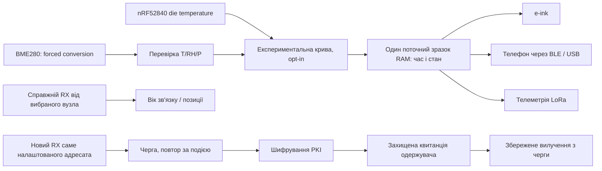

# Архітектура та карта коду

## Де змінювати

| Частина | Код |
|---|---|
| Локальні ID та opt-in | `src/mesh/PairSettings.h`, ignored `PairSettings.local.h` |
| Перевірена ініціалізація BME | `src/modules/Telemetry/Sensor/BME280Setup.h` |
| Конверсія й перевірка полів | `BME280Reading.h`, `BME280Sensor.cpp` у тому самому каталозі |
| Крива та коефіцієнти | `BME280ThermalModel.h`, `BME280ThermalProfile.h` |
| Один зразок і свіжість | `src/modules/Telemetry/LocalEnvironmentCache.h`, `EnvironmentTelemetry.cpp` |
| Годинник і метрики | `src/graphics/draw/ClockRenderer.cpp`, `src/graphics/SharedUIDisplay.cpp` |
| Живлення / MCU рядок | `src/graphics/draw/ClockSensorStatus.h` |
| Показ тексту / непрочитане | `src/graphics/draw/MessageRenderer.cpp`, `MenuHandler.cpp`, `src/MessageStore.cpp` |
| Статус пари / напрямок | `src/mesh/PeerStatus.cpp`, `PeerStatusState.h`, `src/graphics/draw/PeerRenderer.cpp` |
| Індикатор переходу | `src/modules/StatusLEDModule.cpp` |
| Надійна черга | `src/modules/DeliveryQueueModule.cpp`, `src/mesh/DeliveryQueueCodec.h` |
| Імпорт перевіреного контакту | `src/modules/AdminModule.cpp`, `src/mesh/NodeDB.cpp` |
| Час, RTC, довіра до джерела | `src/gps/RTC.cpp`, `TrustedTime.h`, `TrustedRTCRecord.h`, `TimeFormatUtils.h` |
| Валідність GPS | `src/gps/GPS.cpp`, `GPSFixValidity.h` |
| Плата, кириличний шрифт | `variants/nrf52840/t-echo-plus/variant.h`, `platformio.ini` |
| Перевірки | `test/custom_audit/` |

## Інваріанти

1. Невдала конверсія не стає успішним нулем чи попереднім значенням. Відповідь із поточного RAM-зразка зберігає час конверсії.
2. Час останнього RX у цьому сеансі відділений від last_heard у базі вузлів. Відновлення NodeDB після boot не означає нового контакту.
3. Координати без свіжого GPS-фіксу не видаються за поточні. Напрямок до відомої точки не є дорожньою навігацією.
4. Вихідне повідомлення власної черги зберігається до першої передачі. Успішну доставку фіксують лише після відповідної захищеної квитанції. Користувач також може явно скасувати очікування; це не доставка.
5. Перевірений локальний імпорт ключа є окремою подією. Він не є RX-пакетом і не доводить доставку.
6. Коефіцієнти не підмінюють сенсор константою контрольного приладу. Контрольне значення використовується під час офлайн-підбору, а не в робочому циклі прошивки.

## Вибір партнера та межі зберігання

Власна черга працює лише між `PAIR_NODE_A` і `PAIR_NODE_B`; за стандартних нульових ID вона не перехоплює звичайні особисті повідомлення. Сторінка Peer має окрему політику: налаштований партнер, якщо його запис доступний, інакше перший неігнорований favorite. Цей резервний вибір не переналаштовує чергу.

CRC двох копій файлу допомагає виявляти пошкодження та перервані записи. Тексти у flash окремо не зашифровані. PKI автентифікує та шифрує передавання між раціями; воно не є захистом від фізичного читання пам’яті.

Це опис реалізації. Історичні фізичні перевірки персоналізованої прошивки не засвідчують апаратну перевірку нової публічної збірки; див. [TESTING.md](TESTING.md).

## Що потребує власної прошивки

YAML налаштовує підтримувані поля Meshtastic. Власне компонування годинника, код черги, критерії свіжості та емпіричну криву змінюють у C++ і збирають заново. Сам YAML не додає нову сторінку, карту чи Android/iOS логіку.

Перед зміною протоколу черги спочатку перевірте `DeliveryQueueCodec.h` і production-module тести. Зміна формату потребує сумісного оновлення обох кінців і плану для вже збережених повідомлень. Довільні оновлення upstream не вважаються автоматично сумісними з цими змінами.
