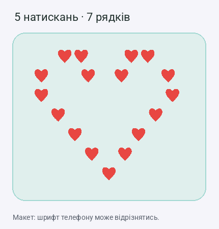

# Контурні сердечка серією натискань

На T-Echo Plus **двічі коротко натисніть основну кнопку гортання** — друга рація пари отримає окреме особисте повідомлення **❤️**. Меню й підтвердження перед надсиланням немає; діє з будь-якої сторінки, зокрема при пробудженні екрана.

Адресат визначається `PAIR_NODE_A` / `PAIR_NODE_B` у локальному `src/mesh/PairSettings.local.h`: A надсилає B, B надсилає A. Власний відкритий ключ адресата має бути в контакті. Невідомий пристрій, відсутній/ігнорований контакт або відсутній ключ дають відмову з повідомленням на екрані. Сердечко шифрується PKI.

## Поведінка кнопки

| Жест | Дія |
|---|---|
| Одне коротке натискання | Поточне гортання/дія інтерфейсу |
| Два короткі натискання з паузою до ~0,4 с | Одне ❤️ партнеру пари |
| Три натискання | Контурне серце заввишки 3 рядки |
| Чотири натискання | Більший контур заввишки 5 рядків |
| П'ять натискань | Найбільший контур заввишки 7 рядків |
| Більше п'яти в одній серії | Один найбільший контур, без додаткових повідомлень |
| Утримання | Поточна дія утримання; сердечко не надсилається |

Для розрізнення одиночного та подвійного натискання одиночна дія тепер чекає вікно до ~0,4 с. Контактний брязкіт фільтрується 30 мс. Звуковий сигнал подвійного натискання для цього жесту вимкнений.

H2 розширив жест до серії (приклади нижче — попередня версія, замінена H3): рішення приймається після паузи ~0,4 с від останнього відпускання. До її завершення проміжне подвійне натискання не надсилає окреме повідомлення. Кожен розмір зростає і по висоті, і по ширині; середина порожня. Зразки 3/5/7 рядків:

```text
❤❤ ❤❤
 ❤ ❤
  ❤
```

```text
 ❤❤   ❤❤
❤  ❤ ❤  ❤
 ❤  ❤  ❤
  ❤   ❤
    ❤
```

```text
  ❤❤     ❤❤
 ❤  ❤   ❤  ❤
❤    ❤ ❤    ❤
❤     ❤     ❤
 ❤         ❤
   ❤     ❤
      ❤
```

Великі контури використовують U+2764 без variation selector; одиночне ❤️ зберігає попередній формат. Це один UTF-8 текст зі збереженими пробілами й переносами. Найбільший шаблон вкладається в ліміт 192 байти шифрованого повідомлення пари. Візуальне вирівнювання залежить від шрифту клієнта; кольори не кодуються окремо.

Це звичайне UTF-8 повідомлення з сердечком у розмові. Воно проходить наявну flash-чергу: у разі недоступності адресата залишається очікувати, повтор запускається RX-подією. Внутрішня захищена квитанція потрібна черзі для завершення доставки й не вимагає дії користувача. Черга має наявні межі та обробку помилок; жест не гарантує фізичний зв’язок.

Сердечко з’являється у локальній історії та передається підключеному телефону як вихідне повідомлення. Це відображення спроби, а не доказ отримання. Отримувач використовує звичайний показ повідомлень і налаштовану вібрацію. Наявний e-ink renderer має зображення для ❤️.

## Код і перевірки

- `src/input/InputBroker.cpp`: прив’язка до основної кнопки та обробка жесту до меню/пробудження.
- `src/input/ButtonThread.*`: окремі параметри вікна натискання й debounce; інші плати зберігають свої початкові значення.
- `src/input/QuickHeart.*`: точний вибір другої рації, перевірка ключа, підготовка текстового пакета та передавання у звичайний send path.
- `test/custom_audit/test_quick_heart.cpp`: реальна бібліотека OneButton — одиночне, серії 2–6, утримання, брязкіт, переповнення часу; UTF-8, PKI, висота/ширина контурів та відмова для неправильного адресата.
- `test/custom_audit/test_delivery_module.cpp`: сердечко у production-черзі, збереження після перезапуску, повтор за RX і завершення за захищеною квитанцією.

Повний набір: `python tools/run_host_tests.py` — 16 suites у H3 (14 у H2). Фізичне натискання, зображення на одержувачі й телефоні перевіряють після встановлення. Прошивка отримувача TH4-R1 уже розуміє такі повідомлення; для відправлення жестом функцію потрібно встановити на відповідну рацію.

## Апаратна перевірка H2

Після встановлення на обидві рації найбільший шаблон (7 рядків, 124 байти UTF-8) надіслано через локальний API в обох напрямках. В обох отримувачів підтверджено точний текст із пробілами/переносами та PKI; обидва відправники отримали захищені квитанції. Ключі й налаштування після прошивання збережені. Це перевірка радіодоставки шаблону; фізичні серії 2–5 натискань та вигляд у телефонному шрифті лишаються окремою перевіркою.


## H3: форма у пропорційному шрифті телефону

Фото з Android показало перекіс H2: звичайний пробіл значно вужчий за emoji. H3 змінює геометрію та використовує U+2003 EM SPACE з короткими звичайними пробілами для вирівнювання. Висота залишається 1/3/5/7 рядків; ширина зростає, середина порожня.



Це макет, а не знімок застосунку. Відступи перевірені з метриками Roboto та пропорцією Noto Emoji: [метрики Noto](https://github.com/googlefonts/noto-emoji/blob/main/NotoColorEmoji.tmpl.ttx.tmpl), [Unicode EM SPACE](https://www.unicode.org/charts/nameslist/n_2000.html). Різні Android/iOS шрифти можуть дещо змінювати відстані; остаточний вигляд потребує перевірки на телефоні.

- Шаблони мають 6 / 43 / 112 / **187 байтів UTF-8**. Один найбільший контур проходить production-чергу разом із внутрішнім адресатом і захищеною оболонкою.
- На e-ink EM SPACE має окремий порожній bitmap, тому не перетворюється на невідомий символ. Вимірювання ширини й малювання використовують однаковий відступ.
- Для власного вихідного контуру рядки e-ink мають спільний лівий край усередині правої бульбашки; індивідуальне вирівнювання кожного рядка праворуч руйнувало б форму.
- Тест `heart_spacing` компілює реальні `EmoteRenderer.cpp` та `emotes.cpp`, перевіряє порожній символ, узгодженість вимірювання/малювання, центри рядків і ширину до 160 px. Повні 15 host-наборів і embedded-збірка пройшли.
- Калібрування TH6 у H3 не змінене. Серед прикладів відображення не зберігаються приватні повідомлення, ключі або ID.


### UTF-8 boundary correction during H3 validation

The first H3 hardware trial delivered the complete seven-row message, but USB sessions disconnected and subsequent logs showed restarted uptimes. A diagnostic run also observed a restart during connection setup before sending a new message. The reset register reported zero; it did not identify a cause.

A separate, reproducible memory error was found in the screen renderer: line wrapping measured text after appending each byte, including incomplete UTF-8 prefixes. `EmoteRenderer` could then copy a full three-byte character past the supplied text buffer. AddressSanitizer reproduced this out-of-bounds read. H3 now wraps complete characters and bounds incomplete characters during measuring, drawing and truncation. The regression test tries every byte prefix of all four heart templates using exact-sized allocations. AddressSanitizer and UndefinedBehaviorSanitizer pass after the correction. This establishes the memory fix; it does not by itself prove the cause of every hardware restart.


To reproduce the focused memory check after installing the build dependencies:

```sh
g++ -std=c++17 -g -fsanitize=address,undefined \
  -Itest/custom_audit/test_emote_stubs -Isrc/mesh/generated \
  -I.pio/libdeps/t-echo-plus/Nanopb -Isrc \
  test/custom_audit/test_heart_spacing.cpp \
  src/graphics/EmoteRenderer.cpp src/graphics/emotes.cpp \
  -o /tmp/heart-spacing-check
ASAN_OPTIONS=detect_leaks=0 /tmp/heart-spacing-check
```


### Screen memory failure identified and corrected

A temporary retained crash record identified the restart as an allocation assertion in the nRF52 `operator new`. A second capture identified the allocation caller as `MessageRenderer::calculateLineHeights`: it requested **1,140 bytes** for 95 `LineMetrics` entries while total free heap was only **1,408 bytes**. The allocation failed despite the nominal total, which does not guarantee a large enough contiguous block.

The renderer now reuses its existing line cache instead of holding old and newly built text simultaneously. Row heights use only the current and following line measurements instead of allocating a full metrics vector. The screen line cap also stops adding headers once the cap is reached. The retained message history and delivery queue limits are unchanged.

`test_message_layout.cpp` runs the production layout helper: mixed text/emoji spacing stays the same, and 100 rows allocate only the returned height array (400 bytes with 32-bit `int`). All 16 host suites pass. The temporary fault handler, retained-memory linker section and allocation instrumentation are removed from the application release build.


### H3 hardware release check

The final application build was installed on both radios. The complete 187-byte, seven-row heart arrived unchanged in both directions, and both senders received authenticated PKI delivery receipts. Configuration and keys matched the pre-update snapshots.

After the cache and layout changes, both radios ran for more than 144 continuous seconds during this check without a USB disconnect or restarted uptime. Local statistics sampled with the message history displayed reported 7,792 bytes free on Radio A and about 8,124–8,148 bytes on Radio B. These are sampled free-heap values, not a guarantee of a lifetime minimum. Physical click sequences and the exact Android/iOS appearance remain user-facing checks; the preview above is a layout mockup.
